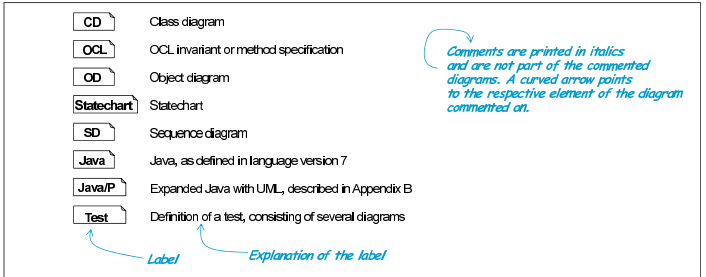
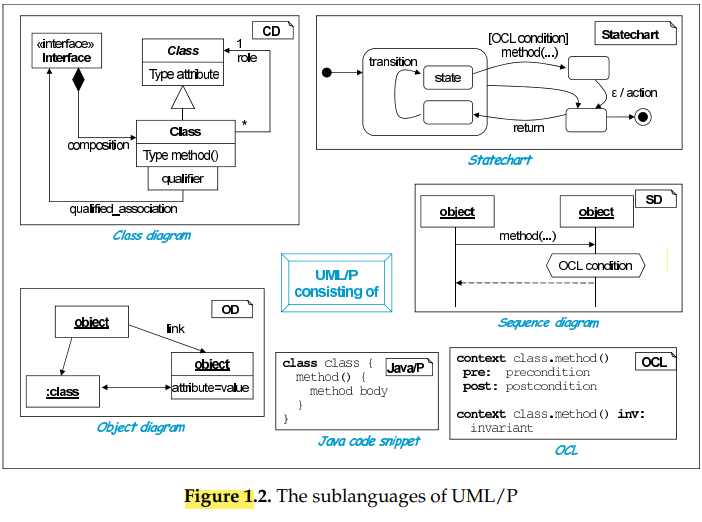

# UML
## Introduction
   - As a result of increasing of the diversty of the software applications domains, There are techniques to manage the projects
   - The portfolio offers competing with problem-specific adventages
   - Repidly changing in technology, the flexibility expected by users and high business applications require constant optimizations
   - By using available software techniques can reach to desires of the customer be developed in an agile way
   - UML provides a efficient developement of high-quality software and meet requirements resulting from differing circumstances
   - UML/P is optimized for recommended development techniques in its terms of design, implementations and maintenance and it resulting from basic research and projecsts
   - object technology is used in new business applications
   - There is no optimal way between gil and UML
   - UML is mostly used in plan-driven with hight documantation
    
   - charaters use in text
     - '...' and '©' descrip the presentation shown is complete or not
     - stereotype << sterotype name >> 
     - tags {tagName=value} or {tagName}
     - Nonteminals

## Placement of UML/P
### Graphical notations vs textual forms
   - Graphical adventages:
     1. quick overview
     2. simplify perceptions
   - Graphical disadventages:
     1. lower information
     2. want more space to be shown or printed
     3. more difficult
### object oriented
   - it is mostly used in software development
   - it deals with more complex systems so there are more object oriented modeling approachs are defined

### UML
   - it is intergerting with other notations
   - it is used with different methodological
   - it can define different possibilities and creates different language profiles respective to different applications

### notations in UML/P
   - UML/P is a subnotation
   - it supports design, implementation and evaluation
   - /p is stardard of usable for programming
   

