# Chapter1

## Why UML(intro)
   - It is used to understand and communicate
   - It avoids a lot of details
   - It helps to understand the software system and business process
   - It is not replacement of textual programming language but it is helpful assistant
   - its importance comes from standerization and wide use with object oriented development
   - the UML is not only used in oo only but also non-oo cicles


  ## What is UML?
   - Unified Modelling Language
   - It belongs to Graphical notation family
   - Build using OO
   - It descripes designing software system
   - programming languages is not high enough abstraction to facilitates the discusion about the design
   - Open standard is controlled by OMG(Object Management Group)

  ## Ways using UML
   - There are different ways to use UML and it leads to difficult arguments
   - To untangle this, there are 3 models (sketch, blueprint, programming languages)
   - Most used model in UML is sketck which used to communicate with all aspects of the system
     - sketch can used also in forword and reverse engineering
     - forword engineering: used in design before writting the code
     - reverse enegineering: used when reading the code to understand it
     - With forword sketching you can communicates the ideas and take less time to discuss the ideas rather than using programming that takes a lot of time
     - With reverse sketching you can simplify the classes and not all only the interesting parts before digging in the code
     - the sketching is useful for decumentations
   - UML blueprint
     - It is about completeness
     - It is a details design to code up
     - That requires a little thought
     - blueprint modelling is an interface to subsystems and let the developers work out implementations of those details
     - In reverse blueprint used to get more details informations about the code
     - forward engineering tools used to make digrams and back up it with repository
     - reverse engineering tools used to make digrams from the code
     - some tools use the source code itself as a repostory and the digrams as a graphical view point


## UML as a programming language
  - UML becomes source code
  - notion of forward and reverse engineering doesn't make sence any more because the diagram and source code is the same thing
  - Model drive acheticture (MDA): is standerd appoache to use UML as a programming language
  - Archtype is an how to turn an executable UML into a programming platform like (J3EE, .NET)
  - How can you repersent the behavior logic?
    -  there is UML behavioral models: use case diagram, state digram and activity diagram
  - Element in UML can be mapped dirctly to software System

## ways of UML
  ### UML dependency
   - somepeople thinks that the UML should be independent on programming langauge
   - someothers thinks that independent is oxymoron
  ### UML essence
   - somepeople think its essence is to be a diagram (sketch)
   - someothers think diagram is secondery and its essence is to be meta-model (blueprint)

## Notation vs meta-model
   - **Notation** is a graphical stuff which defines the concepts and items
   - **meta-model** is a diagram which defines the concepts of language and show the relations between features
  ### how much meta-model affects on notation?
   - sketcher don't care
   - blueprinter care
   - it depends on the state
   - it is inportant for UML as a programming language
  ### importance
   - most people involves in development interested in meta-models
   - Notation is important in decomentation


## UML diagrams
   - UML 2 represent 12  official diagram types
   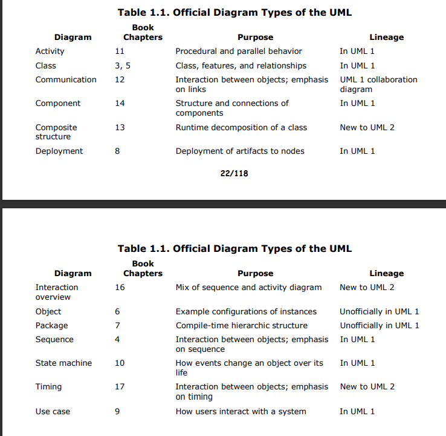
   - you can use different elements from any other diagram type (UML is not rigid)
   - classfications of UML diagram types
   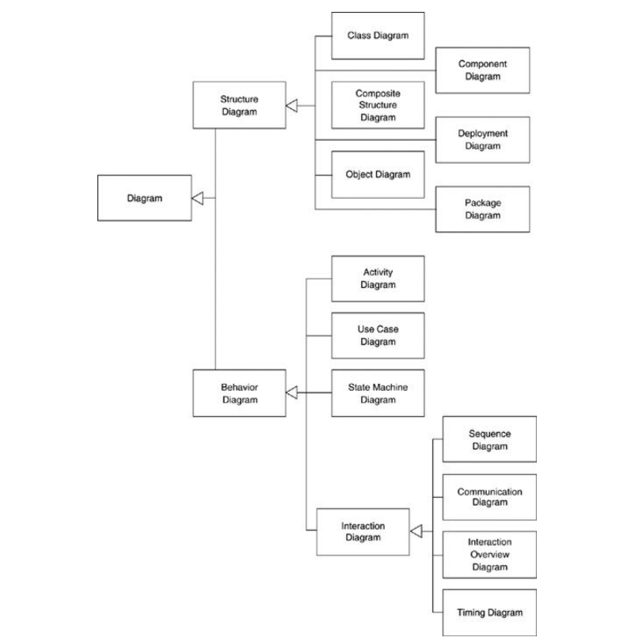


## What is legal UML?
   - Legel UML is what defines as well formed in specifications
   - Like standard of UML
   - But UML is percise language that means there are prescriptive rules and also there are convension rules (that depend on commitee and vendors)
   - Suppressed is when information of something is hidden

## What is UML mean
   - Althogh the specification descripes in greate details that doesn't mean that you know how particular the code look like
   - you only get a rough idea


## UML is not enough
   - in many places it is important to use UML and anthor places you don't have to use it (don't hesitate to unuse UMLs)
   - for example in decision table using table better than using diagrams
   - 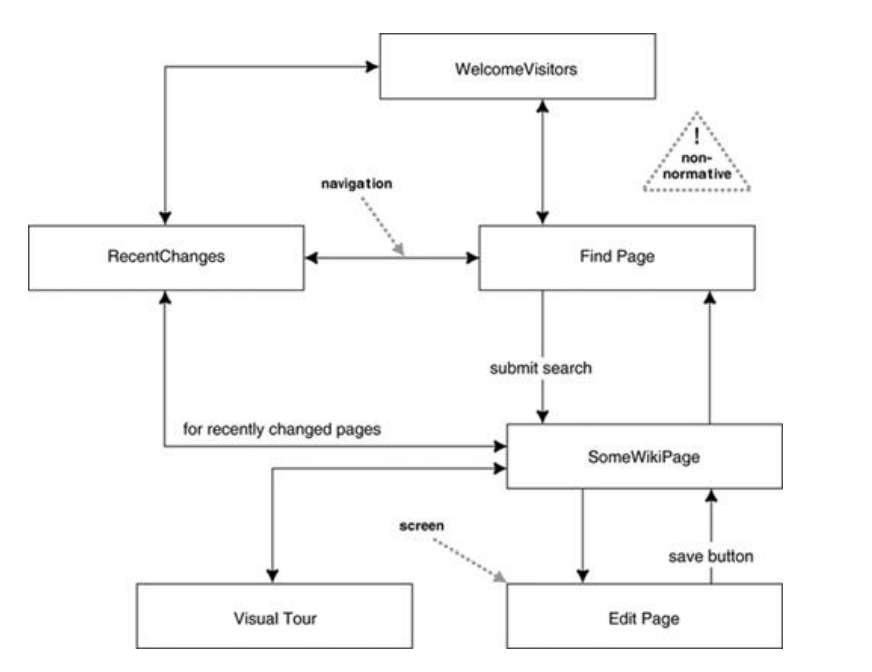
   - 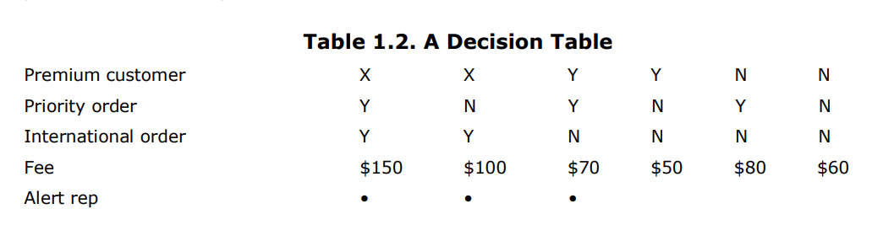
   

# Chapter2
## waterfall vs iteration
   - **waterfall**: break down the project based on activity ( activities: requirements analysis, design, coding, and testing) for example if the year take one year there is 2-month analysis phase, followed by a 4-month design phase, followed by a 3-month coding 
   phase, followed by a 3-month testing phase.
   - **iteration**: break down the project to subsets of functionality, if the project takes one year may make 4 iteration each 3 month each iteration has activities (analysis, design, code, and test)
   - at waterfall model can revisit an activity you should first make sure that the stage is finished to minimize revisiting 'cause it is expensive
   - at iteration model give you quick feedback (after each iteration) at each release
   - there is a hybrid style using both (waterfall and iteration) for example stage delivery that use waterfall when at first make analysis and design and using iteration in coding and testing at each iteration
   - at many projects it is not recommended to use <ins>pure</ins> watedfall
   - the oo comunity favor iteration model
   - each iteration showed provide integrated and tested code, the activity shouldn't have an open-end so you can use **time boxing**
   - **time boxing**: that every iteration have specific time that if it is enough you should slip some functionality to the next iteration
## Rewoking
   - rework is not bad like in manufacturing, it is good at software when rewrok a code that bad designed and there are techniques to do that
     1. Automated regression tests: that helps to detect any defacts
     2. Refactoring: is the way to change the existing software using series of small behavior
     3. continous integration: keeps team in sync to avoid painful integration cycle

## Predictive and Adaptive
   - **predictive**: work hard eary to get good understaning of what should be done later
      - it has two stages:
        1. plan it is hard to be predicted
        2. it is more predictable because the plans are exist
      - it is not a black or white 
      - one of the factors to get a good prediction is understanding of the requirements and the requirements changing at later stages of the project
      - it doesn't means that you cannot fix the budget or scope but you cannot change the functionality
      - you can freeze the requirements early but it is risky
      - there is to ways to solve it
        1. to put much effort at requirements to get more accurate results
        2. using adaptive planning
   
   - **Adaptive**: facing the changes through as a constant in software
     - in adaptive you cannot say that 'according to the plan' that does't means that the is no plan, In fact in adative there is a lot of plan but it is changing as a concequence of changes


## Agile process
   - Agile has a lot of interest at recent years
   - it is an umbrella of some processes like (exterm programming(XP), feature driven development(FDD), ..)
   - uses time boxed
   - using UML in agile as a blueprint, on other hand, sketch used as a programming language
   - At ceremony (project want a lot of decumentations and control points) is not perfere to use agile because to makes it hard to make changes

## Relational Unified Process (RUP)
   - it depends on UML
   - it is a process framwork whick provides a vocabulary and loose structure about the process
   - **development case**: it is the process that you want to develop in the project
   - choose development case needs person uses RUP
   - RUP have 4 phases:
     1. Inception: makes initial evaluation
     2. Elaboration: itentify the primary use cases in the project and built software in iteration order
     3. Construction: continuos building process
     4. Transition: includes various late stages
   - there is fuzzy between the phases

## fitting a process into a project
   - Software projects differ depends on: technology, size and distribution of the team, risks, consequances of the failure and organization culture
   - Consquencly, you should adapt the suitable way to the process
   - and what is the adaptation used in process to fit a project
   - the one benefit of iteration that is supports frequancy process
   - **iteration introspective**:
     1. keep: things that work well
     2. problems: areas that is not working
     3. try: changes to your process


## fitting UML into process
   - Graphical modeling, people think that are the context of waterfall model
   - waterfall models have documenets that have analysis, design and coding phases
   - you still do activities analysis, design, coding and testing, and you can run the project with one iteration that have mini-waterfall

### requirement analysis
   - activiry what is the user or customer, want the system to act
   - UML techniques was used:
     - **use case diagram**: which discrips how the user interact with the system
     - **class diagram**: building up rigorous vocabulary of domain
     - **activity diagram**: show work-flow of the organization and how the software and human interact
     - **state diagram**: interesting in life cycle of states and events
   - diagrams is mostly used in communication and you may communicate with non-technical people so you shouldn't use notation as minimum

### design
   - here, you get more in techincal (more notation and percise)
   - UML techiques was used:
     - **class diagram**: show class and there iterrelate
     - **squance diagram**: get scenarios from use cases
     - **pacage diagram**: show large scale organization
     - **state diagram**: for classes with complex histories
     - **deployment diagram**: for physical layout of the software

   - each end of phase of documentation has UML diagrams
   - in waterfall diagram, we use blueprint
   - in iterative use both (sketch, blueprint)
     - sketch out of design at each iteration, each iteration feel free to change the sketch
     - blueprint you expect the code implementation to follow the diagrams and to do changes only from designer 

### decumentation
   - one you finish software implementation you can use UML to document what you have done
   - detailed documentation should be from the code
   - in prose documents it is perfered to do use sketchs
   - can use package diagram in logic road map of the system
   - each package have the class diagram
   - in class diagram can show the classes and their interaction at the system

### undestanding lagcy code
   - In UML can build sketch of key facts as a graphical not
   - with modern tools you can use details with keys

### choosing development process
   - it is perfered to use iteration development process
   - and using agile software development like (extrem programming xp)


# chapter3 (Class diagram)
## overview
   - it is most UML diagram used in real world
   - it has a greate range of modelling concepts
   - it descrips the types of objects and the static relations between them
   - the class contains (attributes and operations) which called **features**
   - in the figure 
     - the class is a box which is divided into 3 parts (name is bold - attributes - operations)
     - there is also 2 types of relations (association, generalization)
   - 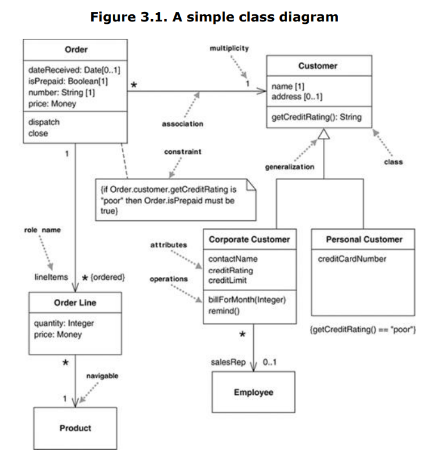

## properties
   - structural feature
   - you can think of it as corresponding to fields in a class
   - contains (attributes, association) although they on diagram different things but in reality they are the same

## Attributes
   - **notation description**: it is a line of text withen the box
   - full form of attribute
     - visibility name: type multiplicity = default {property-string}
     - example
       >>  name: String [1] = "Untitled" {readOnly}
      - **only name** is necessary
      - visiability is shows if it is public(+) or private(-)
      - name corresponding of its name at the programming language
      - type what kind of object (data type in programming language)
      - multiplicity:
      - default the assign value when it is created
      - {property-string} add property to it, and if it missed you can assume that is modifiable
   

## association
   - show the same properties represented at different notations
   - 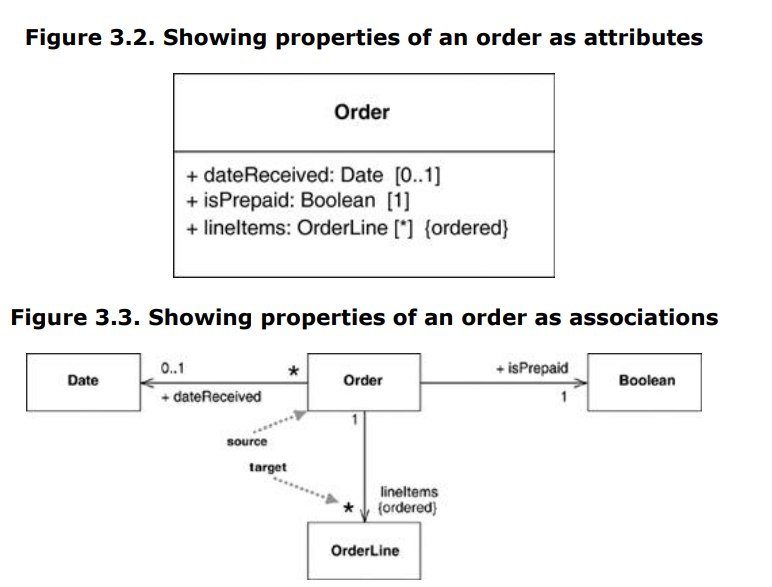
   - it is an solid line between associations (from source to target)
   - the properity goes the target end
   - you can use both attributes and association
   - attributes mostly used at small things like (bool, int, date)
   - association used in significant classes


## when to use class diagram
   - it is the backbone of the UML
   - it is rich with notation that may cause complix things
   - there are some tips to use it:
     - don't use all notations that available to you like: classes, associations, attributes, generalization, and constraints
     - it is used in business, so you should keep things simple
     - don't draw models for everything, to keep up to date
   - the biggest danger is to focus on the structure and forget the behavoir

## multiplicity
   - it is how many objects that fill the property
   - most common:
     - 1 (order for one customer)
     - 0..1 (may one or not sales)
     - \* (zero or more)
   - upper and lower can used with any range 2..5
   - for simplicity using range with the same number can use one number instead ex: 3..3 -> 3
   - \* means 0..* 
   - there are verious terms refer to multiplicity
     - Optional lower-bound of 0
     - mandatory lower-bound of 1 or more
     - single value upper-bound of 1
     - multivalue upper-bound more than 1
   - by default it is (multivalued)
   - if the order have meaning you should write {ordered}
   - if you allow duplicate {nonunique}
   - to show the default {unordered} {unique}
   - there is also collection name, {bag} for unordered and unique
   - discontinous maltiplicity 2, 5 (means 2 or 5) it is allowed in UML1 but it is uncommon and removed from UML2
   - by default it maltiplicity attribute is [1] but you cannot assume that attribute that missing is [1], so it is perfered to use it explicitly

## programming interpertation of property
   - There is a way to interpret the properties in code, there is at programming laguage named as a field or proprery
   - code at java
   ```
   public class OrderLine... 
   private int quantity; 
   private Money price; 
   private Order order; 
   private Product product 
   ```
   - code at c#
   ```
   public class OrderLine ... 
   public int Quantity; 
   public Money Price; 
   public Order Order; 
   public Product Product; 
   ```
   - the programming languages that supports properties it is public 
   - at the programming languages that not support properties the fields is private
   ```
   public class OrderLine... 
   private int quantity; 
   private Product product; 
   public int getQuantity() { 
   return quantity; 
   } 
   public void setQuantity(int quantity) { 
   this.quantity = quantity; 
   } 
   public Money getPrice() { 
   return product.getPrice().multiply(quantity); 
   }
   ```
   - at code notice that getPrice is not a field but it is computed, for customer he couldn't know if it is field nor computed, this hiding information is essence for encapsulation
   - if the maltiplicity is multivalued, data concerned is a collection
   - if the data is ordered that needs for example (list)
   - if the data is unordered needs (set)
   - 
   ```
      class Order { 
      private Set lineItems = new HashSet(); 
      public Set getLineItems() { 
      return Collections.unmodifiableSet(lineItems); 
      } 
      public void addLineItem (OrderItem arg) { 
      lineItems.add (arg); 
      } 
      public void removeLineItem (OrderItem arg) { 
      lineItems.remove(arg); 
      } 
   ```
   - in multivalued attribute usually not assign it but using add and remove methods to control items property
   - the Order class should control the collection and don't leave the collection naked
   - you can use proxy to provide read only
   - you can modify the object but not collection
   - you naver see collections at class diagrams but its fields and accessors
   - at ood you shouldn't provide data to another object
   - it there is many calls for field accessors, you should move the behavior of the object that has the data

## bidirectional association
   - at the figure below: the preson may own any number of the Car and a Car can have owner or not
   - 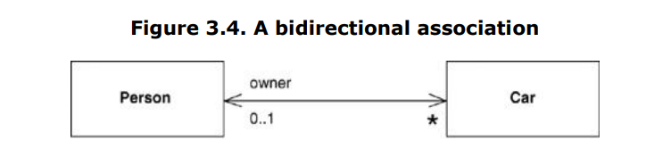
   - Person have cars: Car[*] and Car have owner:Person[0..1]
   - you should here to follow the both properties ex: when update the owner of the Car[Toyta] you should add it also at the cars set at the Person
   - anothor way to do it
   - 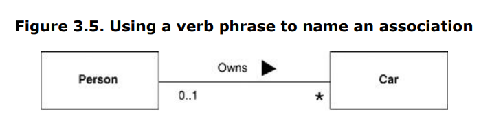
   - at the programming laguage the it is trick because you should keep them sync
   - 
   ```
   class Car...
   public Person Owner { 
   get {return _owner;} 
   set { 
   if (_owner != null) _owner.friendCars().Remove(this); 
   _owner = value; 
   if (_owner != null) _owner.friendCars().Add(this); 
   } 
   } 
   private Person _owner; 
   ... 
   class Person ... 
   public IList Cars { 
   get {return ArrayList.ReadOnly(_cars);} 
   } 
   public void AddCar(Car arg) { 
   arg.Owner = this; 
   } 
   private IList _cars = new ArrayList(); 
   internal IList friendCars() { 
   //should only be used by Car.Owner 
   return _cars; 
   }
   ```

## operations
   - it is an action being taking corrsponding to the method at the class
   - UML syntax: 
      >> visibility name (parameter-list) : return-type {property-string}
     - visibility: public(+) private(-)
     - name: string
     - parameters list: is the parameters passed to the method
     - return type: is the type of returned value
     - property-string: indicates property values that apply to the given operation
     - parameter syntax:
         >> direction name: type = default value 
       - dirction: in or out or inout
       - name: string
       - default value: initial values
   - ex:
      >> \+ balanceOn (date: Date) : Money
   - **Query**: is operation that read items not changing the system state
   - **modifiers**: changing system state and also called as command
   - getting and setting methods: the user cannot know if the getting is query or not or setting is modifiers or not
   - if you have multiversion of method (overload, overrideing) that doesn't affect the operation for example if you have 4 methods overrides eachother you have one operation of them


## Generalization
   - if you have a general class Person (superclass) and also have teach and student they have a common things that are at person class and they called as (subclass)
   - in generalization you avoid the repeatations
   - you can use subclass instead the superclass and everything is work fine
   - using subtype and supertype is not means that only inherite but in general substitutation, but subclass and superclass referes to inheritance

## comments
   -  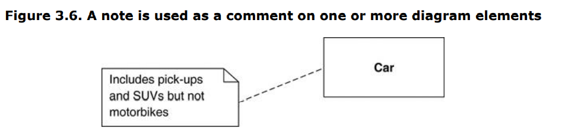

## dependency
   - exist if the changing at the defination of one elementsthat affects on other element
   - if the depandancy is out of control, any change will make ripple affects more and more on many things
   - 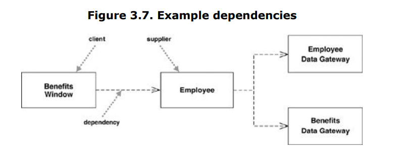
   - the BenfitWindow is dependent on Employee
   - the dependeny here is at one direction
   - there is a keyword that descripes the dependency 
   - 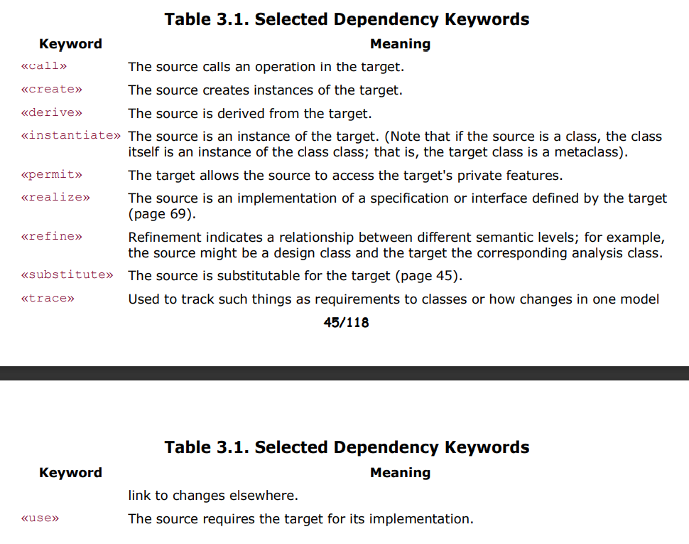
   - the general rule to minimize the dependency
   - you should avoid dependency cycle
   - don't show all the dependencies instead show the important to communicate


## constraints rules
   - Much of what you are doing in drawing a class diagram is indicating constraints. Figure 3.1 indicates 
   that an Order can be placed only by a single Customer. The diagram also implies that each Line 
   Item is thought of separately: You say "40 brown widgets, 40 blue widgets, and 40 red widgets," not 
   "120 things" on the Order. Further, the diagram says that Corporate Customers have credit limits 
   but Personal Customers do not


# chapter4 (squance diagram)
## overview
   - it is most common interaction diagram
   - I consider a single senario and see its behavior through the classes
   - at this example we order some products and get the price
   - 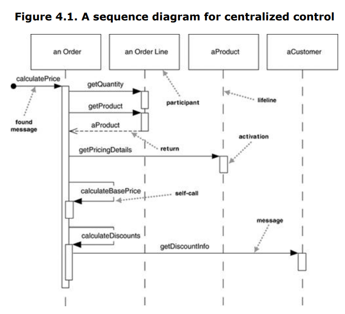
   - it shows the interactions between the participants
   - one of amazing things about squance diagram is you don't have to explain the notations
   - but on other hand, it doesn't show everything very well
   - active bar is shows the participant is active now, and it is optional
   - **found message** is the first message which doesn't have participant
   - the following figure is represent another way to implement it
   - 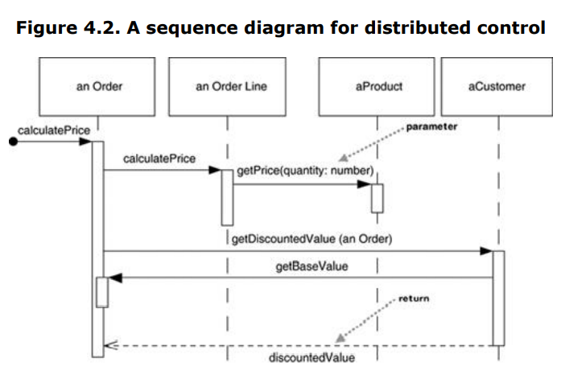
   - **centralize** one participant do all processes and other participants are providing the data
   - **distributed** operations are splited to the participants
   - centralized is more used because it simpler and distributed chasing around the objects
   - but some prefere distributed control because it localize the changing and the data and behavior changing with eachother 
   - by distributing control, you create more opportunities for using polymorphism rather than using conditional logic. If the algorithms for product pricing are different for different types of product, the distributed control mechanism allows us to use subclasses of product to handle these variations

## creating and deleting participants
   - to create use message arrow and usually use new 
   - to delete use X to do deletion
   - 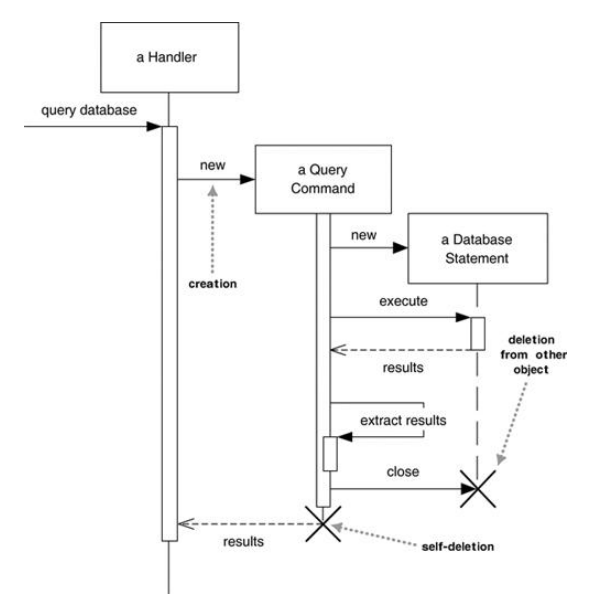
   - deletion doesn't mean that delete the object dirctly but to refere that the object is not needed any more

## conditions and loops
   - it is a common issue to use conditions and loops at sequance diagram
   - activiry diagrma is more efficient at using them
   - we use interaction frames to express them at sequance diagram
   - the frame can be divided into one or more fragments
   - to use loops **loop** operator that with a single fragments
   - to use conditions **alt** operator with multifragments and put each condition with framgments
   - use **org** operator with one region
   - operators
   - 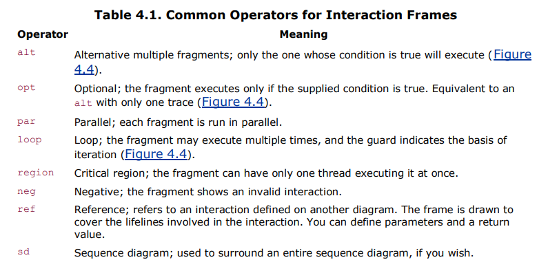

## synchronous and asynchronous
   - ⇽ , filled arrowheads represents a synchronous (must wait until the operations message is done)
   - ← thick arrowhead represents an asynchronous (it can continue processing and doesn't wait for response -multithread-)

## when to use sequance diagram
   - when you want to look to the behevior 
   - and sequance diagrams are good to show collaborations
   - but it is not good for percise definitions
   - it used to see the one senario with multi-object
   - but if you want to see the behavior of one object with many use-cases use state diagram


# chapter 5 class diagram
## keywords
   - sometime it is hard to remember what is the symbol mean. so the UML try to reduce the symbols and use key words instead
   - for example interfaces we use to express icon of the class and «interface».
   - there is an issue that the {abstruct} for example has a curly brackets, and «interface» with guillemets, fortunately it doesn't matter except serious UMLs
   - some keywords are abbreviated. {abstruct} => {A} or «interface» => «I» 
   - in UML1, the guillemets were used mainly for stereotypes
   - in UML2, it descripes what is and isn't sterotypes

## generalization and classifications
   - **is a** key word that may be represent classification or generalization
   - **classification**: the object Shep is an instance of the type Border Collie
   - **generalization**: —the type Border Collie is a subtype of the type Dog
   - classification can be represented using a keyword «instantiate»
   - generalization can be represented using a symbol


# chapter6 object diagram
   - it is a snapshoot at paricular point, it shows the object not the class an it is useful when the connection is complicated
   - you can tell that elements are instants because it is underlined
   - 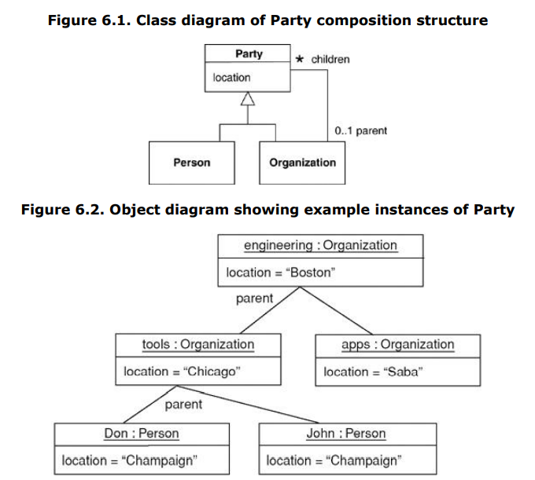
   - the formate
      >> instance name : class name
   - elements of the class diagrams is specification instance because it is partly define things
   - 
## when to use object diagram
   - to show the objects that connected to gether and some times the class diagram is difficult to understand using some objects diagrams that shows the differences

# chapter7 package diagram
## overview
   - using classes is a very basic form of sturcture at oo, we need some thing to show the large systems which may have hunderds of classes
   - **package** grouping the elements to higher level mostly these elements are classes
   - packages may be members of other packages
   - you can think of it as heirarichic structer that package have subpackages these subpackages have classes. (package may has packages and classes)
   - it called in some languages packages and some others call it namespace
   - you can use classes with that name with different packages
   - In diagrams, packages are shown with a tabbed folder, as in figure You can simply show the package name or show the contents too
   - 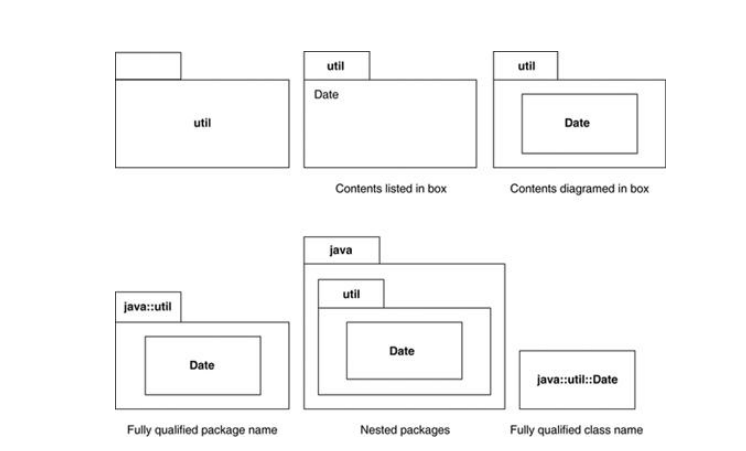
   - it is common to see the a class labled rather than fully qualified form
   - the class at the package can be private or public 
   - you should follow the convention of the programming environment, even if it is bending UML rules
   - the useful technique here is to reduce interface of packages by exploring only subsets of the oprations associated with the package's public classes
   - how to choose the classes to be in the same packages?
     - they are chosen by there dependancy and if they reused together

## packages and dependencies
   - package diagrams shows the packages and their dependences